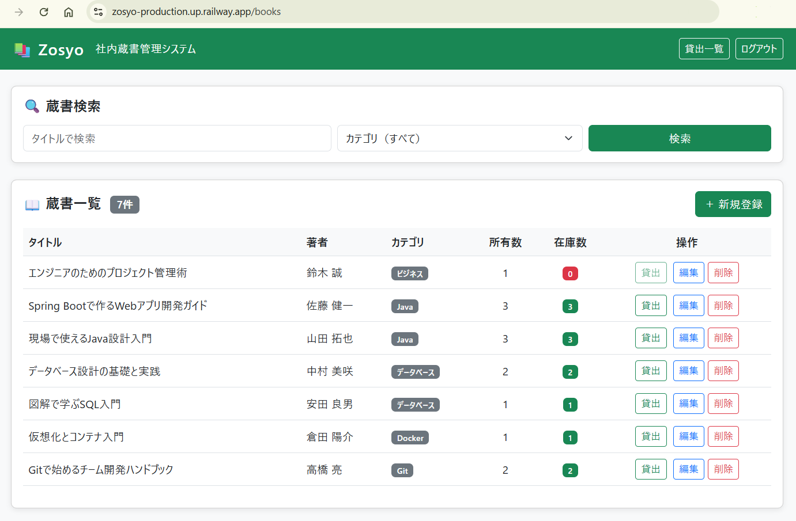
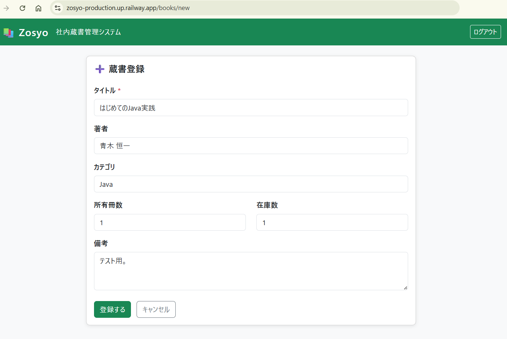
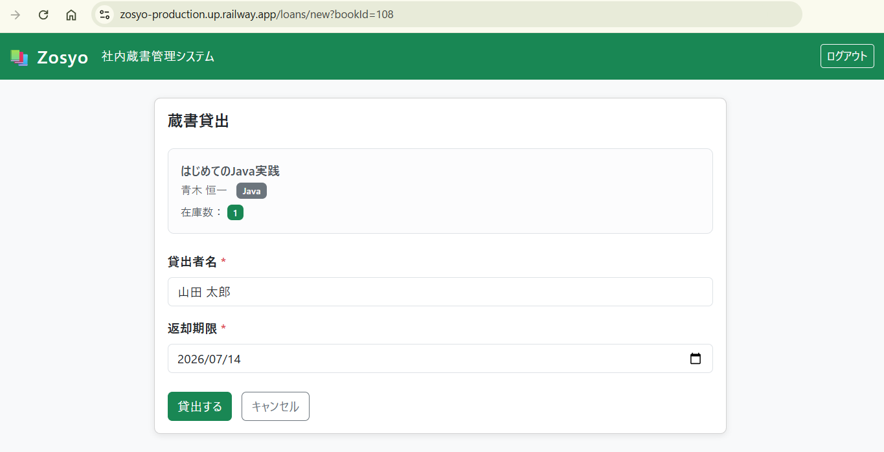
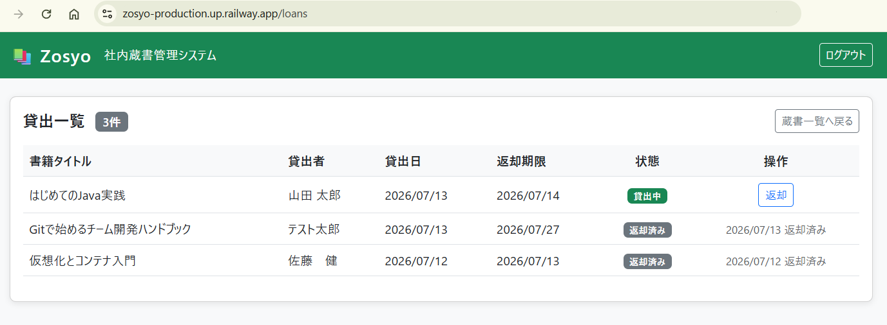
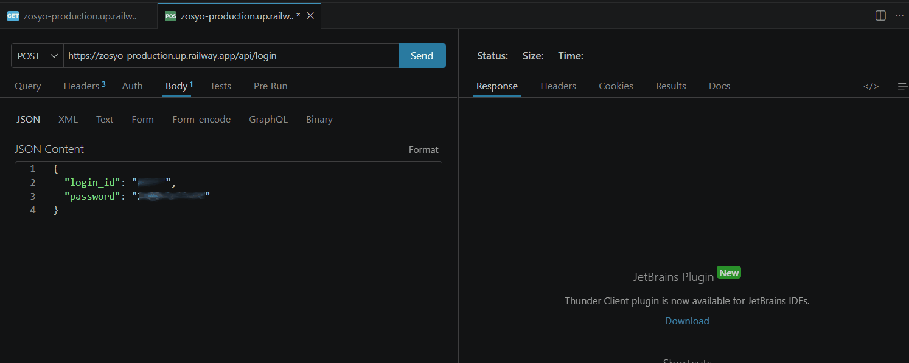

# Zosyo（蔵書）- 社内蔵書管理システム

[](https://openjdk.org/projects/jdk/21/)
[](https://spring.io/projects/spring-boot)
[](https://www.postgresql.org/)
[](https://railway.app/)
[](https://spring.io/projects/spring-security)
[](https://opensource.org/licenses/MIT)

> 前職の経験を元に業務課題をシステム化、SpringBoot + PostgreSQLによる社内蔵書管理用のWebアプリケーションです。
> 下記のデモ版URLから、すぐにお試しいただけます。（ユーザー名とパスワードは、別途お送りしているものをお使い下さい。）

🔗 **デモ版URL：** [https://zosyo-production.up.railway.app/books](https://zosyo-production.up.railway.app/books)

---

### ポイント

- **排他制御**：`@Lock(PESSIMISTIC_WRITE)` による悲観ロックで、同時貸出による在庫の不整合を防止しています。
- **画面とAPIの分離**：Thymeleaf画面（`/books`, `/loans`）とREST API（`/api/**`、9エンドポイント）を分離しつつ、セッション認証を共有。
- **履歴が残る返却処理**：返却は削除ではなく `return_date` の更新方式。二重返却が分かるようにしました。
- **すぐ動かせます**：Railway上にデプロイ済み。

---

### 目次

- [Zosyo（蔵書）- 社内蔵書管理システム](#zosyo蔵書--社内蔵書管理システム)
    - [ポイント](#ポイント)
    - [目次](#目次)
  - [開発した背景](#開発した背景)
  - [デモ画面](#デモ画面)
  - [使用技術](#使用技術)
  - [システム構成](#システム構成)
  - [機能一覧（画面）](#機能一覧画面)
  - [REST API](#rest-api)
  - [ER図](#er図)
  - [ローカル上の起動手順（DockerCompose）](#ローカル上の起動手順dockercompose)
    - [前提条件](#前提条件)
    - [手順](#手順)
  - [ディレクトリ構成](#ディレクトリ構成)
  - [開発時に意識したこと](#開発時に意識したこと)
  - [今後の拡張予定](#今後の拡張予定)
  - [開発者について](#開発者について)
  - [ライセンス](#ライセンス)

---

<a id="background"></a>

## 開発した背景

前職の事務員時代、会社が購入した技術書やビジネス書の管理を、手作業＆Excelシートで行っていました。
手作業は時間がかかりますし、管理者が変わるとExcelシートの作り方も変わるので、更新漏れや貸出記録の消失といった問題が発生しました。
「こういった問題を、システム化することで解決できないか？」と考えていた経験が、このプロジェクトの起点になります。

メイン言語のJavaを学び始めたタイミングで、「学習の成果を課題解決に繋げること。」を目標に開発を始めました。
貸出・返却の在庫管理ロジックとREST APIレイヤーを組み込み、実務で求められる設計(排他制御・例外設計・API画面の分離)を意識した作りになっております。

---

<a id="demo"></a>

## デモ画面

<table>
<tr>
<td width="50%" align="center"><b>蔵書一覧・検索</b><br></td>
<td width="50%" align="center"><b>蔵書登録</b><br></td>
</tr>
<tr>
<td width="50%" align="center"><b>貸出</b><br></td>
<td width="50%" align="center"><b>貸出一覧（貸出中・返却済みの状態表示）</b><br></td>
</tr>
</table>

<p align="center">
<b>🔌 REST API 動作例（Thunder Client）</b><br>

</p>

---

<a id="techstack"></a>

## 使用技術

| 分類           | 技術                                                                      |
| -------------- | ------------------------------------------------------------------------- |
| バックエンド   | Java 21 / SpringBoot 4.0.6 / SpringMVC / SpringDataJPA / SpringSecurity 7 |
| API            | SpringWeb (`@RestController`) / Jackson (JSON) / BeanValidation           |
| フロントエンド | Thymeleaf / HTML / CSS / Bootstrap 5                                      |
| データベース   | PostgreSQL 16                                                             |
| インフラ       | Railway（Serverless構成）                                                 |
| コンテナ       | Docker / DockerCompose                                                    |
| バージョン管理 | Git / GitHub                                                              |
| ビルドツール   | Maven                                                                     |

---

<a id="architecture"></a>

## システム構成

```
[ユーザーのブラウザ]
       │ HTTPS
       ▼
[Railway - SpringBoot]
       │  ├─ 画面(MVC): Thymeleaf / セッション認証
       │  └─ API: /api/** (JSON) / 同一セッションで認証を共有する
       │ JDBC
       ▼
[Railway - PostgreSQL 16]
```

- **デプロイ方式：** GitHub連携による自動デプロイ
- **認証方式：** SpringSecurityのセッション認証を画面・APIの両方で共有
- **環境変数：** DB接続情報はRailway環境変数で管理

---

<a id="features"></a>

## 機能一覧（画面）

| 機能       | 説明                                                         |
| ---------- | ------------------------------------------------------------ |
| 一覧       | 登録された全書籍の一覧表示                                   |
| 登録       | タイトル・著者・カテゴリ・冊数などの新規登録                 |
| 編集       | 既存書籍情報の更新                                           |
| 削除       | 書籍レコードの削除                                           |
| 検索       | タイトル・カテゴリによる絞り込み検索                         |
| 在庫表示   | 在庫あり（緑色表示）/ 在庫なし（赤色表示）で視覚的に判別     |
| 貸出       | 在庫チェック（悲観ロックによる排他制御）を伴う貸出登録       |
| 返却       | 返却日を記録し、二重返却を防止（履歴は削除せず保持する）     |
| 認証       | SpringSecurityによるログイン認証（BCryptパスワードハッシュ） |
| ログアウト | セッション破棄・ログイン画面へのリダイレクト                 |

---

<a id="restapi"></a>

## REST API

画面(MVC)とは別に、`/api/**` 配下にJSONベースのREST APIを実装しています。
認証は画面と同じセッションを共有し、未認証アクセスには `401`、業務エラーには `404`/`409` を返します。

| メソッド | エンドポイント           | 説明                               | 認証 |
| -------- | ------------------------ | ---------------------------------- | ---- |
| POST     | `/api/login`             | ログイン（セッション確立）         | 不要 |
| GET      | `/api/books`             | 書籍一覧取得                       | 必要 |
| GET      | `/api/books/{id}`        | 書籍情報取得                       | 必要 |
| POST     | `/api/books`             | 書籍登録                           | 必要 |
| PUT      | `/api/books/{id}`        | 書籍更新                           | 必要 |
| DELETE   | `/api/books/{id}`        | 書籍削除                           | 必要 |
| GET      | `/api/loans`             | 貸出中の書籍一覧取得               | 必要 |
| POST     | `/api/loans`             | 貸出登録（在庫チェック・排他制御） | 必要 |
| POST     | `/api/loans/{id}/return` | 返却処理（二重返却防止）           | 必要 |

**エラー例**

| ステータス | 発生条件                                 |
| ---------- | ---------------------------------------- |
| 400        | バリデーションエラー（必須項目未入力等） |
| 401        | 未認証                                   |
| 404        | 対象の書籍・貸出記録が存在しない         |
| 409        | 在庫切れ／返却済みの貸出に対する再返却   |

> 補足：画面用の `/books`, `/loans` と API 用の `/api/books`, `/api/loans` は、
> URLの衝突を避けるため意図的にパスを分離しています。

---

<a id="erd"></a>

## ER図

```
books
  ├── id            BIGSERIAL      PRIMARY KEY
  ├── title         VARCHAR(100)   NOT NULL         （書籍タイトル）
  ├── author        VARCHAR(100)                    （著者名）
  ├── category      VARCHAR(50)                     （カテゴリ）
  ├── quantity      INT            NOT NULL DEFAULT 1  （総冊数）
  ├── stock         INT            NOT NULL DEFAULT 1  （在庫数）
  ├── note          VARCHAR(100)                     （備考）
  ├── created_at    TIMESTAMP                        （登録日時）
  └── updated_at    TIMESTAMP                        （更新日時）

loans
  ├── id            BIGSERIAL      PRIMARY KEY
  ├── book_id       BIGINT         NOT NULL  FK → books.id
  ├── borrower_name VARCHAR(100)   NOT NULL         （貸出者名）
  ├── loaned_at     TIMESTAMP      NOT NULL         （貸出日時）
  ├── due_date      DATE           NOT NULL         （返却期限）
  └── return_date   TIMESTAMP                       （返却日時／NULL=貸出中）

users
  ├── id            BIGSERIAL      PRIMARY KEY
  ├── username      VARCHAR(50)    NOT NULL UNIQUE  （ユーザー名）
  ├── password      VARCHAR(255)   NOT NULL         （BCryptハッシュ）
  └── enabled       BOOLEAN        NOT NULL DEFAULT TRUE

authorities
  ├── username      VARCHAR(50)    NOT NULL         （usersへの外部キー）
  └── authority     VARCHAR(50)    NOT NULL         （ROLE_USER）
```

> 補足：入力フォームの文字数制限（バリデーション）は30文字以内としていますが、
> DBカラム長には余裕を持たせています。（※将来の要件変更や多言語対応を見据えた設計です）

---

<a id="setup"></a>

## ローカル上の起動手順（DockerCompose）

### 前提条件

- Docker / DockerCompose がインストール済みであること

### 手順

```bash
# 1. リポジトリのクローン
git clone https://github.com/akito256a/zosyo-submission.git
cd zosyo-submission

# 2. コンテナのビルド＆起動
docker compose up --build

# 3. ブラウザでアクセス
open http://localhost:8080/books
```

初回起動時はテーブルが自動生成されますが、ログイン用ユーザーは別途登録が必要です。
`docker compose exec db psql -U zosyo_user -d zosyo_db` でコンテナ内のPostgreSQLに接続し、
`users` / `authorities` テーブルへ手動でユーザーを登録して下さい。（パスワードはBCryptでハッシュ化して下さい。）

---

<a id="structure"></a>

## ディレクトリ構成

```
zosyo/
├── src/
│   ├── main/
│   │   ├── java/com/zosyo/
│   │   │   ├── config/       # セキュリティ設定（SecurityConfig）
│   │   │   ├── controller/   # 画面用MVCコントローラー
│   │   │   │   └── api/      # REST APIコントローラー
│   │   │   ├── dto/          # APIリクエスト/レスポンス用DTO
│   │   │   ├── entity/       # JPAエンティティ
│   │   │   ├── exception/    # カスタム例外・APIエラーハンドラー
│   │   │   ├── repository/   # SpringDataJPAリポジトリ
│   │   │   └── service/      # ビジネスロジック
│   │   └── resources/
│   │       ├── templates/    # Thymeleafテンプレート
│   │       └── application.properties
├── Dockerfile
├── docker-compose.yml
├── railway.toml
└── pom.xml
```

---

<a id="designnotes"></a>

## 開発時に意識したこと

- **排他制御**：`@Lock(PESSIMISTIC_WRITE)` による悲観ロックで、同時貸出による在庫の不整合を防止しています。
- **画面とAPIの分離**：Thymeleaf画面（`/books`, `/loans`）とREST API（`/api/**`、9エンドポイント）を分離しつつ、セッション認証を共有。
- **履歴が残る返却処理**：返却は削除ではなく `return_date` の更新方式。二重返却が分かるようにしました。
- **すぐ動かせる**：Railway上にデプロイ済なので、実際に操作出来ます。

---

<a id="roadmap"></a>

## 今後の拡張予定

- [ ] JWT認証への移行（ステートレスなAPI化）
- [ ] CSVエクスポート機能（他のシステムで読み込める用途）
- [ ] React / TypeScript によるフロントエンドの刷新（モダンなWebアプリを目指す）
- [ ] JUnit / Mockito によるテストコード整備（高速で再現性のあるテスト環境の構築）

---

<a id="about"></a>

## 開発者について

事務員からWebエンジニアへ、キャリアチェンジを目指して学習中です。
前職の経験を活かし、「課題をシステムで解決する」視点を大切にしています。また、「迷わず使える」UI/UXにこだわった設計を目指しています。

- GitHub：[@akito256a](https://github.com/akito256a)

---

<a id="license"></a>

## ライセンス

[MIT License](./LICENSE)
